# Architecture Overview

Agent-as-Code (AaC) uses a unique hybrid architecture that combines a high-performance Go core with flexible runtime environments, primarily focusing on Python for AI/ML workloads.

## System Architecture

### High-Level System Overview

This diagram maps the primary Go packages and CLI entry points to their roles in the system. Commands in `internal/cmd/*` invoke the parser (`internal/parser/agent.go`), builder (`internal/builder/builder.go`), runtime (`internal/runtime/runtime.go`), and registry (`internal/registry/registry.go`).

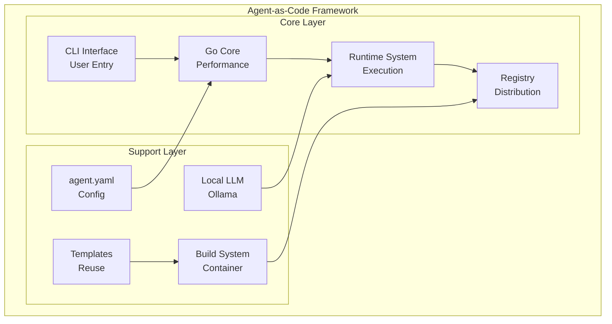

### Detailed Component Architecture

This view links user surfaces (CLI in `internal/cmd/*`) to core subsystems and execution/storage backends used during `agent init/build/run/push` flows.

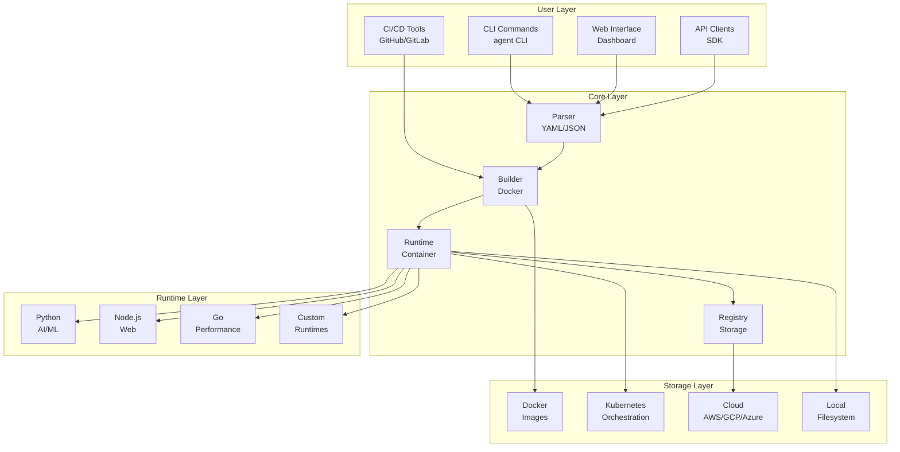

### Data Flow Architecture

End-to-end flow grounded in the codepath: `internal/cmd/*` → parser (`ParseFile/Validate`) → builder (`generateDockerfile/buildDockerImage`) → image → registry (`Push/Pull`) → runtime (`Run/Stop/StreamLogs`).

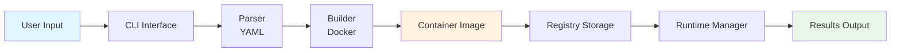

## Component Architecture Diagrams

### 1. Parser Component Architecture

Reflects types and methods in `internal/parser/agent.go`: `AgentSpec`, `AgentMetadata`, `AgentSpecDetails`, and methods `FindAgentFile`, `ParseFile`, `Parse`, `Validate`.

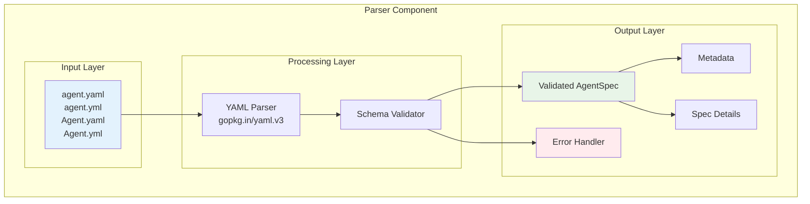

#### Parser Data Flow

Concrete call sequence in the parser: `FindAgentFile` → file read → YAML unmarshal → `Validate` (required fields, runtime allowlist, port checks) → `AgentSpec` in-memory model.

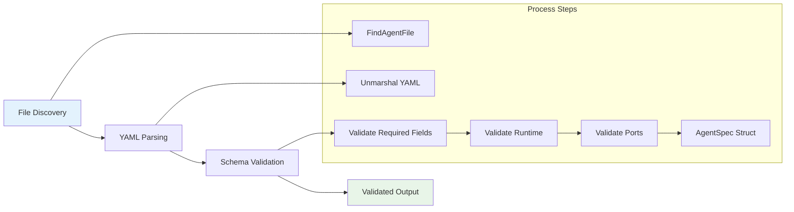

### 2. Builder Component Architecture

Based on `internal/builder/builder.go`: `ValidateContext` ensures a valid `agent.yaml`; `generateDockerfile` emits runtime-specific Dockerfiles; `buildDockerImage` streams build output; `Push` publishes tags.

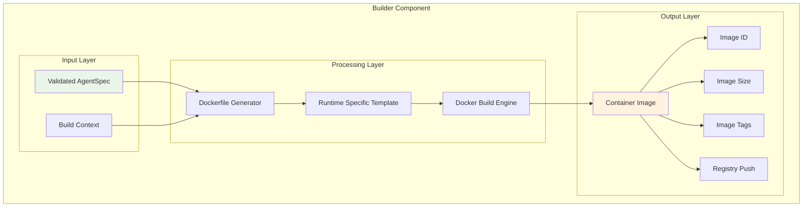

#### Builder Process Flow

Build phases as implemented: parse/validate config → generate Dockerfile (runtime templates) → Docker build (BuildKit via API) → optional push to a registry.

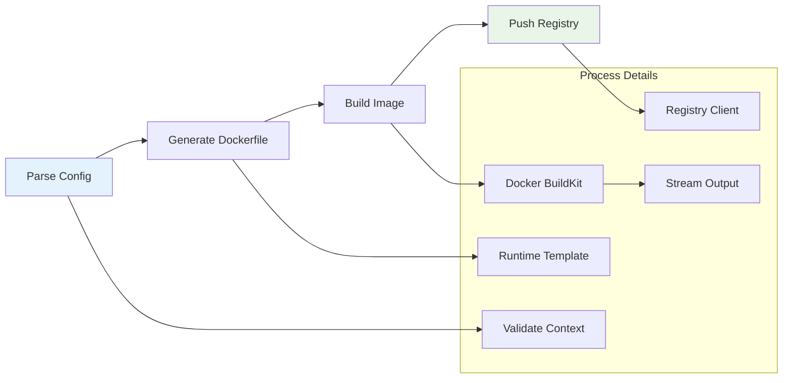

### 3. Runtime Component Architecture

From `internal/runtime/runtime.go`: `Runtime` uses the Docker client to create/start containers with parsed ports, env, volumes; returns `ContainerInfo` and can stream logs or stop containers.

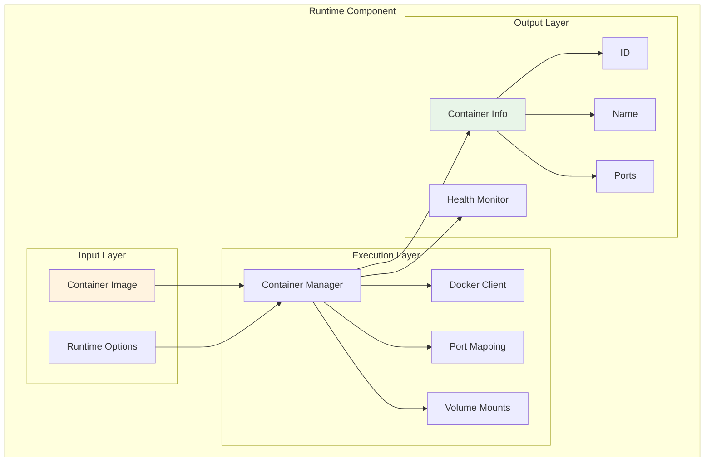

#### Runtime Execution Flow

Execution path in code: `ValidateImage` (local inspect) → `ContainerCreate` with port bindings/env/volumes → `ContainerStart` → log streaming and health handling.

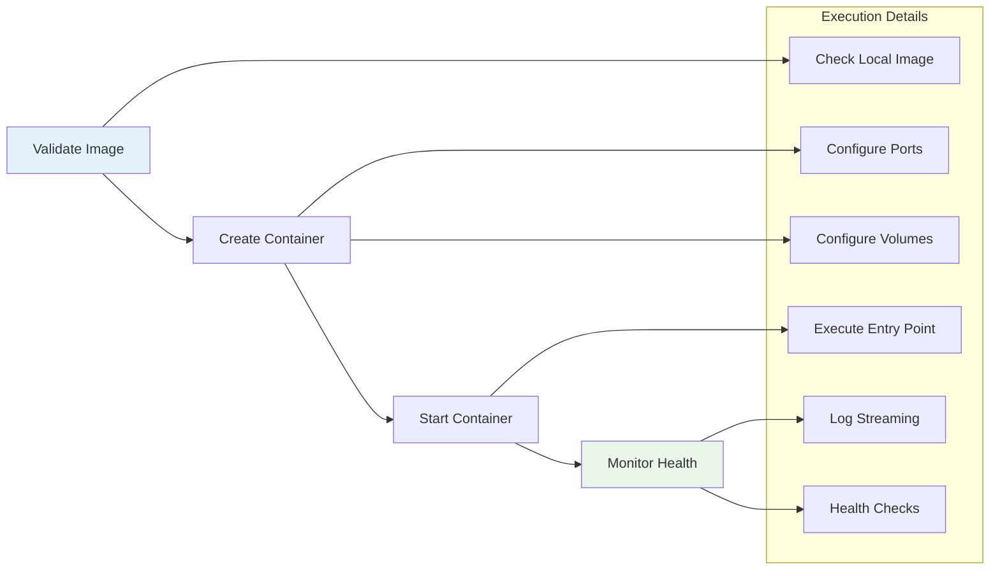

### 4. Registry Component Architecture

Grounded in `internal/registry/registry.go`: routes operations to Docker Hub or custom agent registries; supports `Push`, `Pull`, local image listing, and basic filtering.

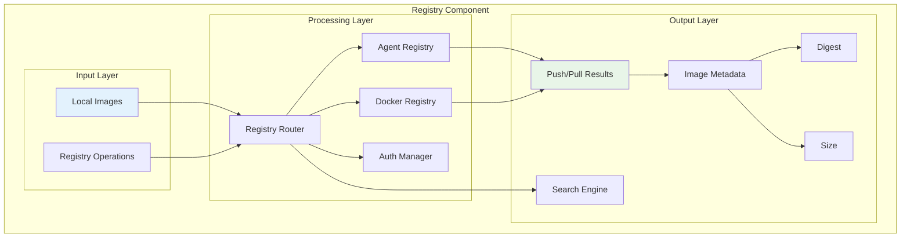

#### Registry Operation Flow

Operational flow: validate auth/token → choose registry target → stream push/pull via Docker API → parse basic results (repository/tag/digest/size).

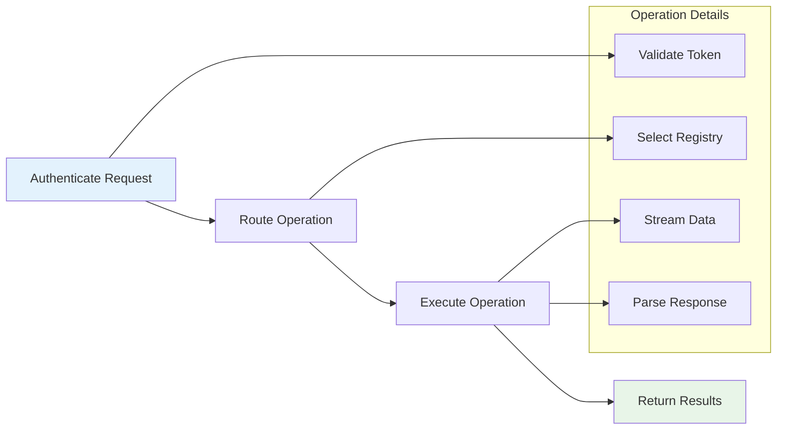

## System Integration Architecture

### Complete System Integration

How `internal/cmd/init.go`, `build.go`, `run.go`, and `push.go` wire the CLI to parser, builder, runtime, and registry, matching the end-to-end developer workflow.

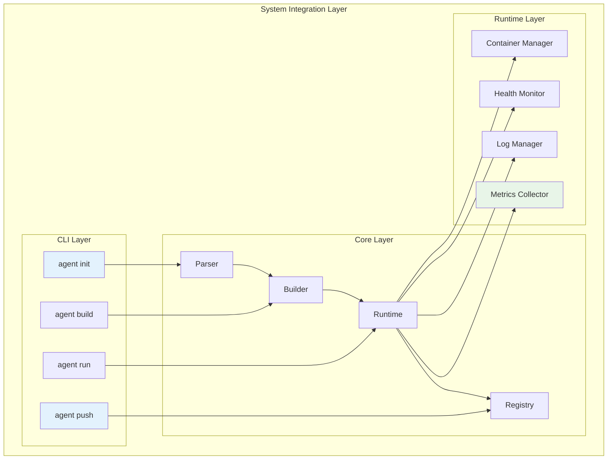

### Deployment Architecture

Reference deployment topology for the images produced by the builder and pushed by the registry client. Scaling/orchestration is handled by the target platform (e.g., Docker/Kubernetes).

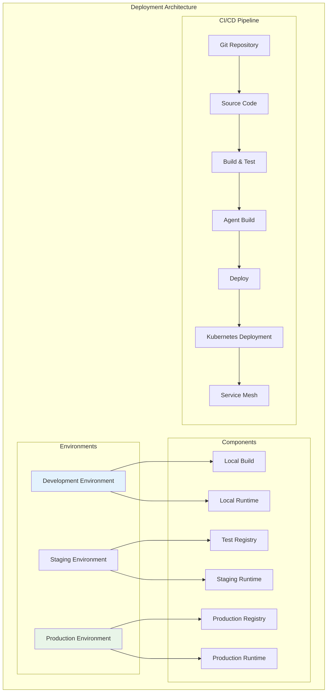

## Security Architecture

### Security Layer Architecture

Security facets reflected in code: use of `AGENT_REGISTRY_URL`/`AGENT_REGISTRY_TOKEN` in `registry.New()`, environment inspection in `version.go`, and Docker client auth delegation for registry operations.

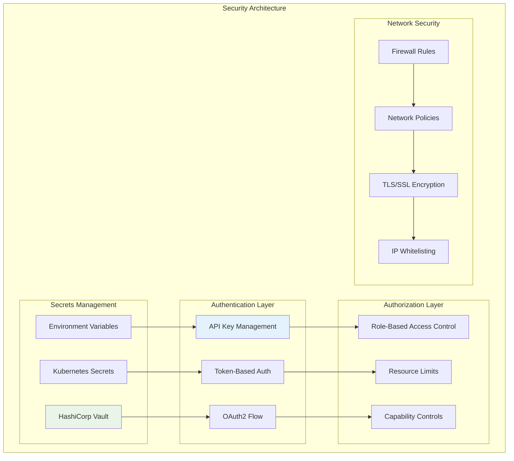

### Security Flow

High-level request hardening steps complementary to the current CLI; registry operations authenticate via Docker client or provided tokens, with auditability via CLI output/logs.

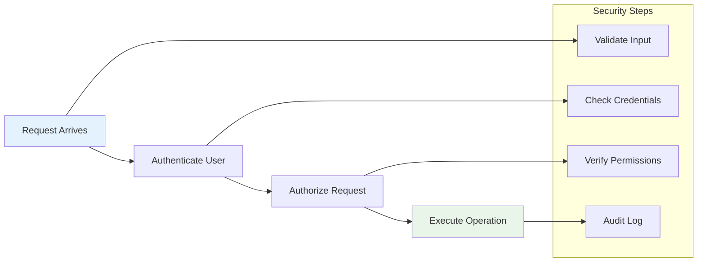

## Monitoring & Observability Architecture

### Monitoring Stack Architecture

Operational visibility built around Docker metrics/logs: `Runtime.StreamLogs` supports continuous log streaming; additional metrics/alerts are intended to be provided by the deployment platform.

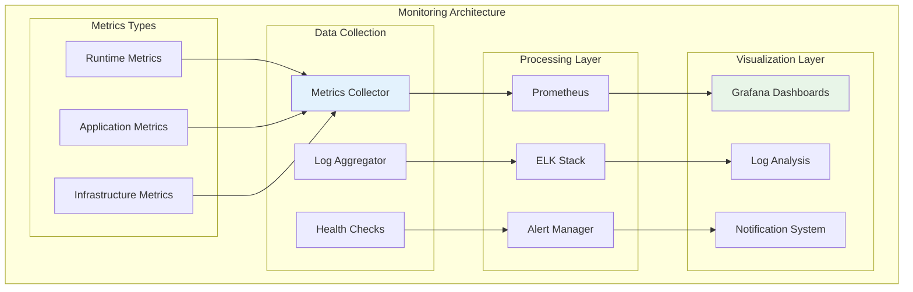

### Monitoring Data Flow

Reference flow for integrating container runtime logs/metrics into a typical Prometheus/Grafana and ELK stack when agents are deployed in production.

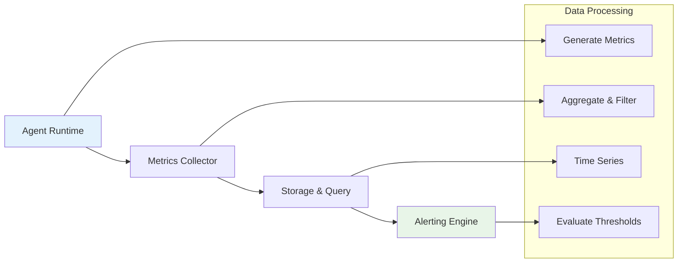

## Scalability Architecture

### Horizontal Scaling Architecture

Reference scaling model: AaC outputs container images; horizontal/vertical scaling is performed by the orchestrator (e.g., HPA/VPA in Kubernetes) around the built agent containers.

```mermaid
flowchart TB
    subgraph "Scalability Architecture"
        subgraph "Load Balancer"
            TD[Traffic Distribution]
            HC2[Health Checks]
            SA[Session Affinity]
        end
        
        subgraph "Auto-scaling Engine"
            HPA[HPA (K8s)]
            VPA[VPA (K8s)]
            CM2[Custom Metrics]
        end
        
        subgraph "Resource Management"
            CM3[CPU Monitoring]
            MM[Memory Monitoring]
            SM2[Storage Monitoring]
        end
    end
    
    TD --> HPA
    HC2 --> VPA
    SA --> CM2
    
    HPA --> CM3
    VPA --> MM
    CM2 --> SM2
    
    style TD fill:#e3f2fd
    style SM2 fill:#e8f5e8
```

### Scaling Decision Flow

Decision loop situates outside of AaC code and acts on platform metrics; AaC remains the image/entrypoint provider for scaled workloads.

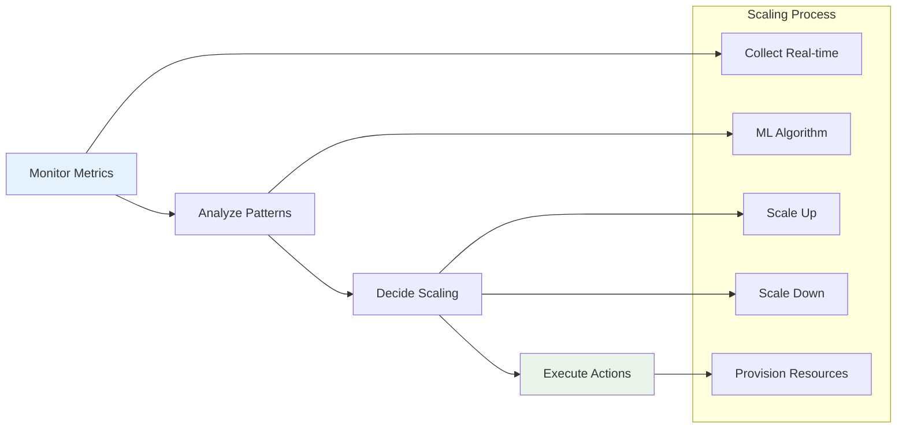

## Production Deployment Architecture

### Production Environment Architecture

Production topology illustrating how the built agent images run behind gateways and load balancers with service mesh and storage integrations—consistent with containerized deployment of AaC agents.

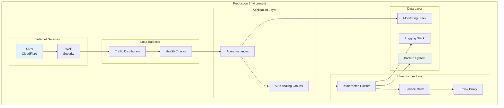

### High Availability Architecture

Reference HA design for running multiple agent instances and stateful dependencies across regions; the AaC-produced images participate as stateless workloads.

```mermaid
flowchart TB
    subgraph "High Availability"
        subgraph "Primary Region"
            AS[Active Services]
            DM[Database Master]
            SP[Storage Primary]
        end
        
        subgraph "Secondary Region"
            SS[Standby Services]
            DR2[Database Replica]
            SB[Storage Backup]
        end
        
        subgraph "Failover Mechanism"
            HM2[Health Monitoring]
            AF2[Auto Failover]
            DS3[Data Sync]
        end
    end
    
    AS --> HM2
    DM --> DS3
    SP --> DS3
    
    HM2 --> AF2
    AF2 --> SS
    DS3 --> DR2
    DS3 --> SB
    
    style AS fill:#e3f2fd
    style AF2 fill:#e8f5e8
```

## Performance Optimization Architecture

### Performance Tuning Architecture

Performance guidance tied to current implementation: the builder optimizes context creation (skips dotfiles), orders layers for better caching, and relies on Docker’s caching; runtime uses Docker APIs efficiently.

```mermaid
flowchart TB
    subgraph "Performance Architecture"
        subgraph "Application Level"
            CO[Code Optimization]
            AO[Algorithm Efficiency]
            CS[Caching Strategy]
        end
        
        subgraph "Runtime Level"
            MP[Memory Pooling]
            CP[Connection Pooling]
            RL2[Resource Limits]
        end
        
        subgraph "Infrastructure Level"
            CA[CPU Affinity]
            NT[Network Tuning]
            SO2[Storage Optimization]
        end
        
        subgraph "Caching Strategy"
            L1C[L1 Cache<br/>Memory]
            L2C[L2 Cache<br/>Redis]
            L3C[L3 Cache<br/>CDN]
        end
    end
    
    CO --> MP
    AO --> CP
    CS --> RL2
    
    MP --> CA
    CP --> NT
    RL2 --> SO2
    
    CS --> L1C
    CS --> L2C
    CS --> L3C
    
    style CO fill:#e3f2fd
    style L3C fill:#e8f5e8
```

## Future Architecture Roadmap

### Planned Enhancements

Forward-looking areas to consider alongside the current code: broader runtime integrations, improved caching strategies in the builder, and richer orchestration hooks around the runtime/registry.

```mermaid
flowchart LR
    subgraph "Future Architecture"
        subgraph "Phase 1 (Q2 2024)"
            ELL[Enhanced Local LLM]
            MC2[Model Caching]
            MP2[Multi-Platform]
        end
        
        subgraph "Phase 2 (Q3 2024)"
            AO2[Advanced Orchestration]
            SM4[Service Mesh]
            CM4[Custom Metrics]
        end
        
        subgraph "Phase 3 (Q4 2024)"
            AIP[AI/ML Pipeline]
            EC[Edge Computing]
            QC[Quantum Computing]
        end
        
        subgraph "Innovation Areas"
            AML[AutoML Pipelines]
            FL[Federated Learning]
            IOT[IoT Integration]
            QS[Quantum Security]
        end
    end
    
    ELL --> AO2
    MC2 --> SM4
    MP2 --> CM4
    
    AO2 --> AIP
    SM4 --> EC
    CM4 --> QC
    
    AIP --> AML
    EC --> IOT
    QC --> QS
    
    style ELL fill:#e3f2fd
    style QC fill:#e8f5e8
```

## Core Components

### 1. Go Core (Performance Layer)

The Go core provides:
- High-performance CLI operations
- Configuration parsing and validation
- Build system
- Runtime orchestration
- Registry operations

Key features:
- Fast startup time
- Low memory footprint
- Cross-platform compatibility
- Strong type safety
- Concurrent operations

Implementation:
```go
// Core configuration parser
type AgentSpec struct {
    APIVersion string           `yaml:"apiVersion"`
    Kind       string           `yaml:"kind"`
    Metadata   AgentMetadata    `yaml:"metadata"`
    Spec       AgentSpecDetails `yaml:"spec"`
}

// Runtime manager
type RuntimeManager struct {
    runtime  string
    model    ModelConfig
    config   map[string]interface{}
}

// Builder system
type Builder struct {
    parser  *Parser
    runtime *RuntimeManager
    registry *Registry
}
```

### 2. Runtime System (Execution Layer)

The runtime system manages:
- Agent execution environments
- Model integration
- Resource management
- Monitoring and health checks

Supported runtimes:
- Python (primary for AI/ML)
- Node.js
- Go
- Rust
- Java

Example Python runtime:
```python
class AgentRuntime:
    def __init__(self, config: dict):
        self.model = self.init_model(config)
        self.capabilities = self.load_capabilities(config)
        
    async def execute(self, input: dict) -> dict:
        result = await self.model.generate(input)
        return self.process_result(result)
```

### 3. Registry System (Distribution Layer)

Handles:
- Agent image storage
- Version management
- Distribution
- Authentication

Features:
- Secure storage
- Version control
- Access management
- Image validation

### 4. Configuration System

Based on `agent.yaml`:
- Kubernetes-inspired format
- Declarative configuration
- Validation system
- Environment management

Example:
```yaml
apiVersion: agent.dev/v1
kind: Agent
metadata:
  name: my-agent
spec:
  runtime: python:3.11
  model:
    provider: openai
    name: gpt-4
```

### 5. Template System

Provides:
- Reusable agent templates
- Best practice implementations
- Quick start capabilities
- Customization options

## Data Flow

1. **Build Process**
```
agent.yaml → Parser → Validator → Builder → Runtime → Image
```

2. **Execution Flow**
```
Image → Runtime Manager → Model Setup → Agent Execution → Results
```

3. **Distribution Flow**
```
Image → Registry Client → Authentication → Upload → Distribution
```

## Integration Points

### 1. Model Integration

```python
class ModelManager:
    def __init__(self, config: dict):
        self.provider = config["provider"]
        self.model = self.load_model(config)
    
    async def generate(self, prompt: str) -> str:
        return await self.model.generate(prompt)
```

### 2. Runtime Integration

```go
type RuntimeIntegration struct {
    Name     string
    Version  string
    Handler  func(config map[string]interface{}) error
}

func (r *RuntimeIntegration) Execute(input []byte) ([]byte, error) {
    // Runtime-specific execution logic
}
```

### 3. Registry Integration

```go
type RegistryClient struct {
    URL      string
    Auth     AuthConfig
    Transport http.RoundTripper
}

func (r *RegistryClient) PushImage(image Image) error {
    // Image push logic
}
```

## Security Architecture

1. **Authentication**
   - API key management
   - Token-based auth
   - Registry authentication

2. **Authorization**
   - Role-based access
   - Resource limits
   - Capability controls

3. **Secrets Management**
   - Environment variables
   - Secure storage
   - Runtime injection

## Monitoring & Observability

1. **Metrics**
   - Runtime statistics
   - Model performance
   - Resource usage

2. **Logging**
   - Structured logging
   - Error tracking
   - Audit trails

3. **Health Checks**
   - Agent status
   - Model health
   - Resource monitoring

## Performance Considerations

1. **Go Core**
   - Minimal memory footprint
   - Fast startup time
   - Efficient concurrency

2. **Runtime Optimization**
   - Resource pooling
   - Cache management
   - Memory efficiency

3. **Distribution**
   - Efficient image format
   - Layer caching
   - Delta updates

## Development Workflow

1. **Local Development**
   ```bash
   agent init my-agent
   agent build -t my-agent:dev .
   agent run my-agent:dev
   ```

2. **Testing**
   ```bash
   agent test my-agent:dev
   agent inspect my-agent:dev
   ```

3. **Deployment**
   ```bash
   agent push my-agent:latest
   agent deploy my-agent:latest
   ```

## Best Practices

1. **Configuration**
   - Use version control
   - Implement validation
   - Document changes

2. **Development**
   - Follow templates
   - Use type hints
   - Write tests

3. **Deployment**
   - Use staging
   - Monitor resources
   - Implement logging

## Future Architecture

Planned enhancements:
1. Enhanced local LLM support
2. Improved model caching
3. Advanced orchestration
4. Extended runtime support
5. Enhanced security features

## See Also

- [CLI Reference](./cli-overview.md)
- [Configuration Guide](./agent-configuration.md)
- [Runtime Guide](./runtime.md)
- [Security Guide](./security.md)